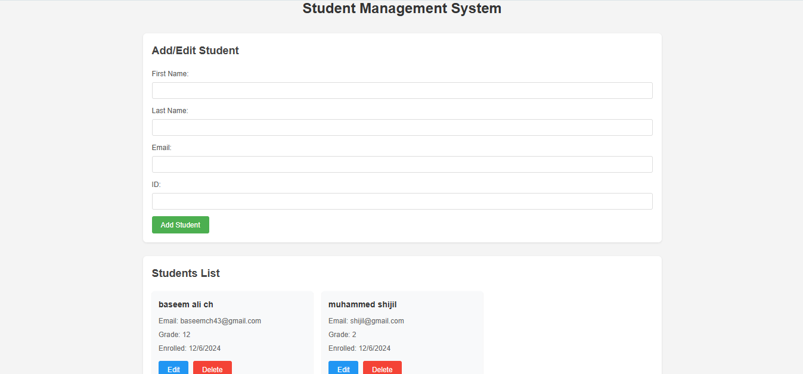

# 🎓 Student Management System

A simple and intuitive **Student Management System** built with HTML, CSS, and TypeScript. This application allows users to add, edit, delete and manage student information effortlessly. 
site is live at https://baseem-ali-ch.github.io/Student-Management-Typescript/
---

## 🌟 Features

- 📋 **Add/Edit/Delete Students**  
  Capture and update student details like name, email, and ID.  

- 🧾 **Dynamic Students List**  
  Automatically updates the students list upon adding or editing entries.

- ✨ **User-Friendly Interface**  
  A clean and responsive design for seamless interaction.

---

## 🛠️ Technology Stack

- **HTML** - Structure of the application  
- **CSS** - Styling for the interface  
- **TypeScript** - Dynamic functionality  

---

## Screenshot



---

## 📂 Folder Structure

```plaintext
student-management-system/
│
├── index.html         # Main HTML file
├── style.css          # CSS file for styling
├── script.ts          # TypeScript file for functionality
└── README.md          # Project documentation
